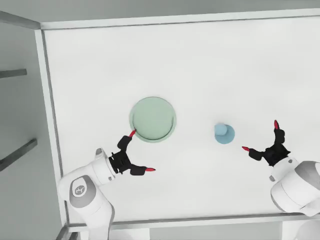

# 腕部连接外壳恢复显示（2026-10-10）

头部录像中的左右夹爪看起来悬空，是因为旧 `wrist_visual_aligned_v3` 为贴近训练手套画面，把 `fixed_visual` 与 `franka_adapter` 的可见网格隐藏了。对应刚体和碰撞体一直存在。

当前配置 `wrist_visual_aligned_v3_housing_visible` 在 USD session layer 将这四个网格的 visibility 改为 `inherited`，恢复实际 CAD 连接。已同步到当前 4090 控制台的杯子与新任务源码。未重建碰撞网格或调整相机、光照、控制参数。旧录像保持原样。

## 验证

- 4090 头部、左腕、右腕同步静态保持渲染完成，正常退出；各 4 帧，640×480，30 fps。没有调用模型。
- 240 Hz 物理及 128 次求解仍沿用高精度杯配置。
- 比较旧外观与新外观：1,131 项物理属性、169 项 physics/physx 关系、87 个碰撞体的几何与材料绑定一致。
- 两侧电机外壳与适配件均为可见且有实体网格。

[验证 JSON](results/wrist_housing_visible_20261010.json)

[左腕画面](results/wrist_housing_visible_20261010/video_left_wrist.png) · [右腕画面](results/wrist_housing_visible_20261010/video_right_wrist.png)

## 模型比较边界

外壳也会进入腕相机输入，图像遮挡与旧 v3 不同。修正仅验证可见性与物理一致性，尚未重新评估模型成功率；旧 v3 的视觉拟合指标及完整任务结果不能直接作为新外观的效果证据。新运行 manifest/report 会记录独立配置 ID。
